# Dynatrace Live Debugger OpenTelemetry + OpenPipeline Demo

The Demo environment will showcase the following:

- Setup of the **Dynatrace OneAgent** within a local Kuberentes cluster
- Deployment of the OpenTelemetry Demo App with the High CPU Feature Flag Bug enabled
- OpenPipeline to create problems based on incoming logs identifying high CPU
- Collecting debug data from the application with the **Dynatrace Live Debugger**
- Using distributed traces to discover more information about the issue using the Trace ID collected from the Live Debugger

## Demo App

The OpenTelemetry Demo app and source code can be found here: https://github.com/open-telemetry/opentelemetry-demo. The source code will be needed for Live Debugger excercises. Clone this repository locally as we'll use it later.

## Quickstart

1. Start a codespaces workspace by going to Codespaces and then selecting 'New with options' or by [clicking here](https://github.com/codespaces/new?hide_repo_select=true&ref=main&repo=865083078&skip_quickstart=true). You will need the following:

    - Dynatrace tenant endpoint which should look something like 'https://abcd1234.live.dynatrace.com' 
    - Dynatrace Operator Token
    - Dynatrace Ingest Access Token with the following permissions:
        - metrics.ingest
        - logs.ingest
        - openTelemetryTrace.ingest

2. The codespace will automatically create a [Kind](https://kind.sigs.k8s.io/) Kubernetes cluster and deploy the OpenTelemetry application. Once the codespaces is started the following services should be running in the Kind cluster:

   ```sh
   kubectl get pods
   ```

   After a few minutes, you should see the Pods in a `Running` state:

   ```
    NAME                                                          READY   STATUS    RESTARTS      AGE
    dynatrace-collector-opentelemetry-collector-6b76c5ff8-7m4b4   1/1     Running   0             3m53s
    my-otel-demo-adservice-5964788696-bwkls                       1/1     Running   0             3m50s
    my-otel-demo-cartservice-7c8cb4cb57-5xz7p                     1/1     Running   0             3m49s
    my-otel-demo-checkoutservice-6b9f9bf69b-dmdp6                 1/1     Running   0             3m47s
    my-otel-demo-currencyservice-8b9fbd4-8rdzz                    1/1     Running   0             3m48s
    my-otel-demo-emailservice-6d9b44f597-lt9qw                    1/1     Running   0             3m49s
    my-otel-demo-flagd-7784c87764-mcv5f                           1/1     Running   0             3m49s
    my-otel-demo-frauddetectionservice-599d7d4f9-2pv5r            1/1     Running   0             3m49s
    my-otel-demo-frontend-6bc6f5dc86-j7kgf                        1/1     Running   0             3m47s
    my-otel-demo-frontendproxy-659d876cbc-j7h9h                   1/1     Running   0             3m50s
    my-otel-demo-imageprovider-6647c84766-phhft                   1/1     Running   0             3m47s
    my-otel-demo-kafka-56486466b4-4h997                           1/1     Running   0             3m49s
    my-otel-demo-loadgenerator-57c889658c-nr8jb                   1/1     Running   0             3m48s
    my-otel-demo-paymentservice-658b866bf6-fdhf9                  1/1     Running   0             3m48s
    my-otel-demo-productcatalogservice-74976d9bd9-g8hwh           1/1     Running   0             3m48s
    my-otel-demo-quoteservice-6bb8d5559c-vlcr9                    1/1     Running   0             3m48s
    my-otel-demo-recommendationservice-6c9b77d946-t2t55           1/1     Running   0             3m49s
    my-otel-demo-shippingservice-ff587b64c-kv5ws                  1/1     Running   0             3m49s
    my-otel-demo-valkey-6666c54b9b-m6pk6                          1/1     Running   0             3m49s
   ```

3. The [Dynatrace OneAgent](https://docs.dynatrace.com/docs/setup-and-configuration/setup-on-k8s) will also be deployed in the cluster using the Dynatrace Operator. You can validate the Operator is running by using the following command:

   ```sh
    kubectl get dynakubes -n dynatrace
   ```

    It should be in a `Running` state:

    ```
    NAME       APIURL                                    STATUS       AGE
    kind-k8s   https://abc123.live.dynatrace.com/api     Running      98s
    ```

You may need to also restart the AdService pod to ensure the live debugger is enabled properly. To do so, run the following command after the Dynakube is in a running state:

   ```
    kubectl rollout restart deployment/adservice
   ```

4. Next, forward traffic from the service to your local machine using:

    ```sh
    nohup kubectl port-forward svc/my-otel-demo-frontendproxy 8080:8080 &
    ```

5. Click the popup that appears to open the application in a new tab, or navigate to the "Ports" tab from the terminal and copy the URL from the row with port 8080.


6. Before proceeding to the next steps, we'll need to create an OpenPipeline pipeline and a dynamic route to allow Dynatrace to trigger a problem based on ingested logs related to the High CPU load issue we'll be debugging. Navigate to the OpenPipeline app by using **Ctrl/Cmd + K**.

    Make sure **Logs** is selected from the left hand OpenPipeline menu and click on the **Pipelines** tab. To the right of the screen click the **+ Pipelines** button to create a new pipeline. Change the pipeline name from **Untitled Pipeline** to **High CPU**.

    Click **+ Processor** and select **DQL** as the processor type. Use the following values:

    - **Name**: add alertme
    - **Matching condition**:
      ```
      matchesPhrase(service.name, "adservice")
      and
      matchesPhrase(content, "High CPU-Load")
      ```
    - **DQL processor definition**:
      ```
      fieldsAdd alertme = "true"
      ```
    - **Sample data**:
      ```
      {
      "service.name": "adservice",
      "content": "High CPU-Load"
      }
      ```

      Click **Run sample data** and you should see:
      ```
      {
        "results": [
          {
            "matched": true,
            "record": {
              "service.name": "adservice",
              "alertme": "true",
              "content": "High CPU-Load",
              "timestamp": "2024-10-01T23:49:20.528000000Z"
            }
          }
        ]
      }
      ```
      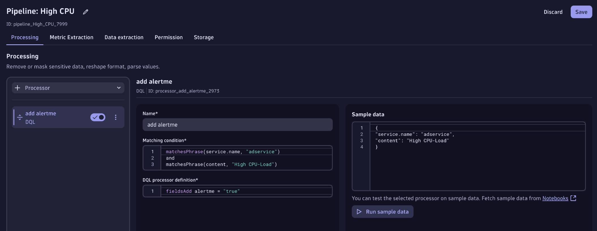

      Click on the **Data extraction** tab. Click **+ Processor** and select **Davis Event** as the processor type. Use the following values:

      - **Name**: Send High CPU Error
      - **Matching condition**: alertme == "true"
      - **Event name**: High CPU Load
      - **Event description**: {supportInfo}
      - **Event properties**:
        - **event.type**: ERROR_EVENT
        - **event.name**: High CPU Load
        - **event.description**: {supportInfo}
        - **dt.source_entity**: {dt.source_entity}

      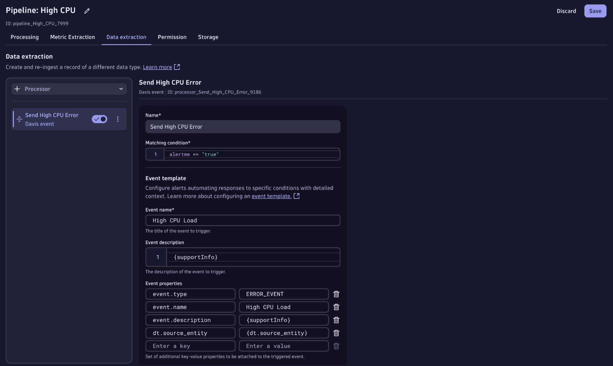
      
      Save the pipeline.


7. Next we'll create a dynamic route which will match data in the logs and send it to our High CPU pipeline we just created. Click on the **Dynamic routing** tab and click **+ Dynamic Route** to add a new dynamic route. Use the following values:

    - **Name**: adservice route
    - **Matching condition**: 
      ```
      matchesPhrase(content, "High CPU-Load")
      and
      matchesPhrase(service.name, "adservice")
      ```
    - **Pipeline**: High CPU

    Save the dynamic route.

    

8. Now back in the OpenTelemetry Demo app, navigate to a product page. This will trigger a high CPU bug within the AdService that displays ads on the product pages.


9. After hitting the product page, the AdService will log a high CPU message into the AdService logs. You can view the log message by running the command below. Replace the pod name with your adservice pod name:

  ```sh
  kubectl logs my-otel-demo-adservice-5964788696-bwkls  
  ```
You should see:

```
2024-10-01 00:40:10 - oteldemo.problempattern.CPULoad - High CPU-Load problempattern enabled trace_id=0ae354209be0f2825a584f174c67c399 span_id=a43ae306b73c31fe trace_flags=01 
```

10. Based on our Log Ingest pipeline and Dynamic route we just created, a new Problem with the name **High CPU Load** should be created within the Dynatrace Problems app.

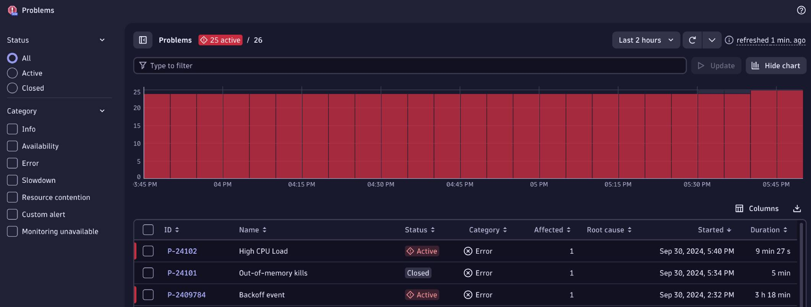

11. Click into the **High CPU Load** problem to review the details. From here we can review the affected services, event properties, and even view the application logs directly in context of the problem.

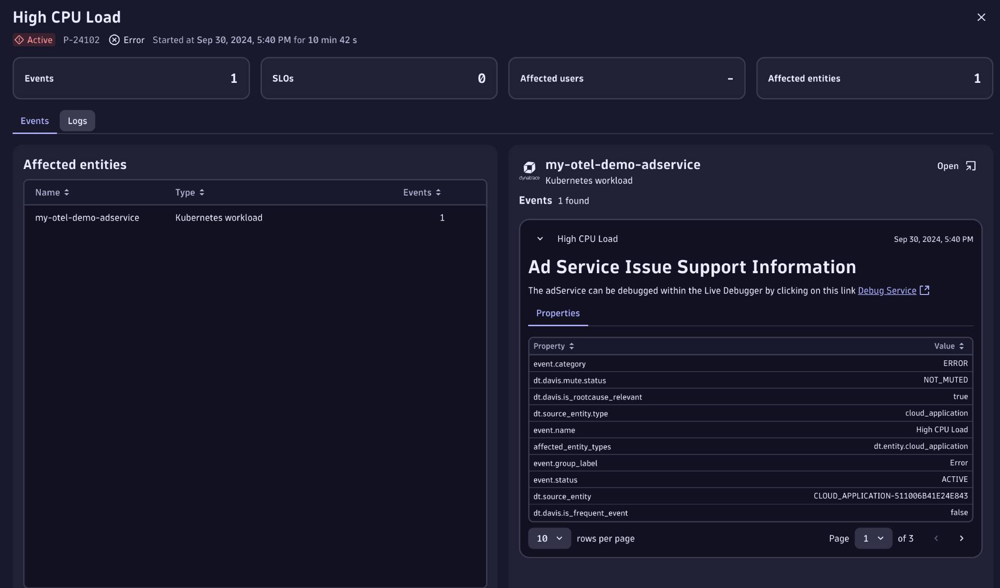

12. You'll notice on the right side of the screen that there is a message which tells us that **the adService can be debugged within the Live Debugger by clicking on this link**. Click on the **Debug Service** link to open the Live Debugger and start a debug session to review what's happening at the code level.

13. Now within the Live Debugger, notice that the adservice filter is already selected for us based on the **k8s.container.name** filter. This was done through a deep link embedded from the Problem screen that we just clicked on.

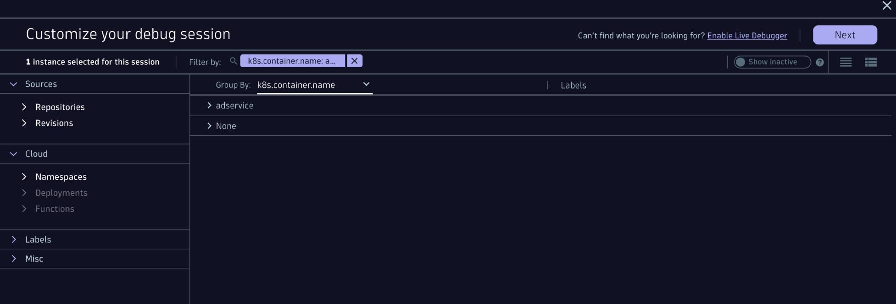

14. Click Next to go to the next screen where we can setup our debug session. From here click the **+** button and select the local filesystem option. If you haven't done so yet, clone the [Open Telemetry Demo repository](https://github.com/open-telemetry/opentelemetry-demo) onto your local machine. 

    First install the Dynatrace Desktop App if you haven't done so. This is a background app which allows you to connect locally cloned repositories to the Live Debugger.

    Once installed, start the Desktop App and then select the Open Telemetry Demo repository that you've cloned locally and click **Add Repository**.

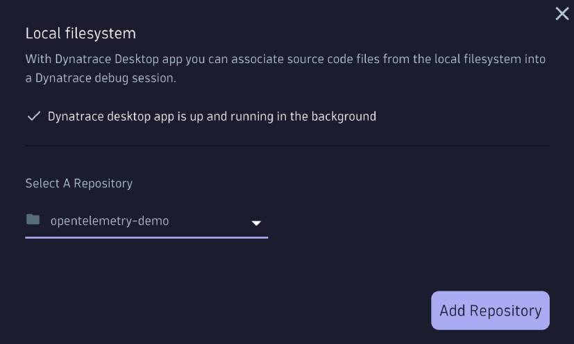

15. Finally click **Done** to be taken to the Live Debugger. Open the **AdService.java** file by navigating the directory structure or using the search capability by clicking on the magnifying glass icon. Navigate to line 174 and click just to the left of the line number to set a Non-Breaking breakpoint. The breakpoint should become solid purple.

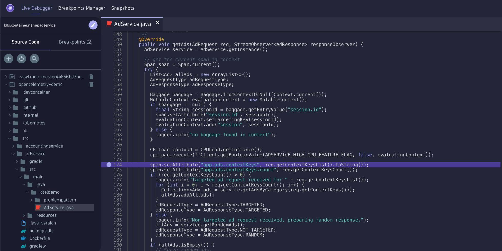

16. Navigate back to the OpenTelemetry Demo app in your browser and refresh the product page. This should trigger the code, executing line 174 and capture a snapshot of debug data. From the debug snapshot we can see a CPULoad object and a **runningWorkers** array variable with worker threads that are running contributing to the high CPU load in the service.


17. Navigate to the **Tracing** tab and expand the **Raw Data** section to view the **traceId** for this transaction.

    We now have a snapshot of debug data as well as the specific OpenTelemetry trace ID for this transaction. We can now take this trace ID and navigate to the Distributed Traces app to view the trace correlated with this transaction. 
    
    Right click on the traceId and select **Copy value** so we can use it in the next step.

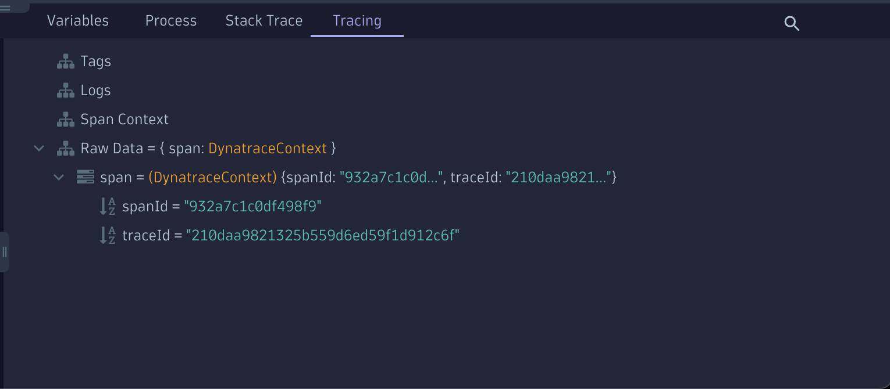    

18. In the Distributed traces app, let's search for this specific trace using the trace ID we just copied. In the **Filter requests** section use  the **Trace ID** filter and paste in the trace ID copied in the last step. You should see the trace filtered below.

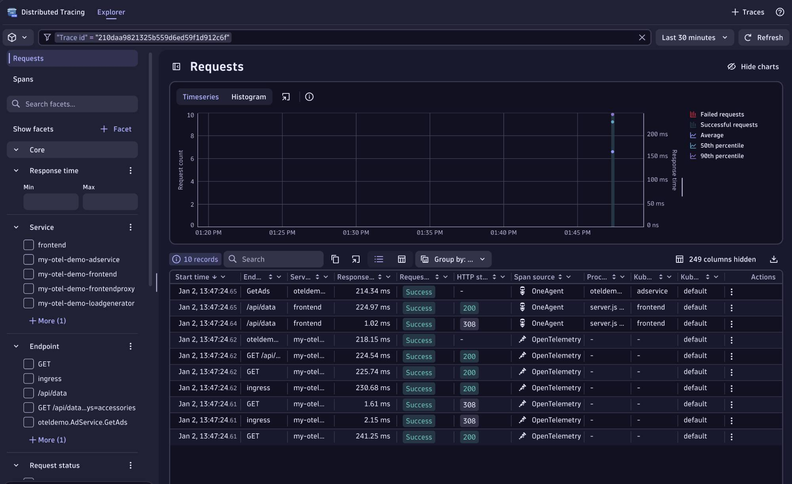

19. Click the **GetAds** row to view the visual trace. Jumping into the trace we are able to view the entire distributed trace which the debug snapshot we captured was a part of. Now we want to examine the process in more detail. Click on the **oteldemo.AdService** link on the right side to be taken to the service where we can view the process details.

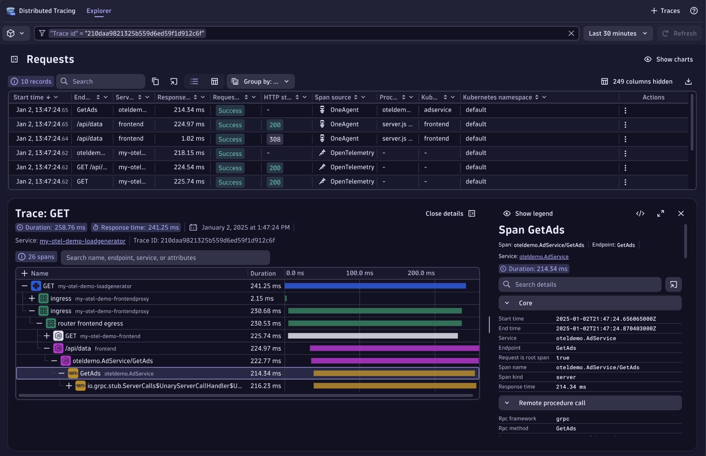

20. To access the **Process** click into the **Info** tab and then select the **Process Group** link to be take to the process screen.

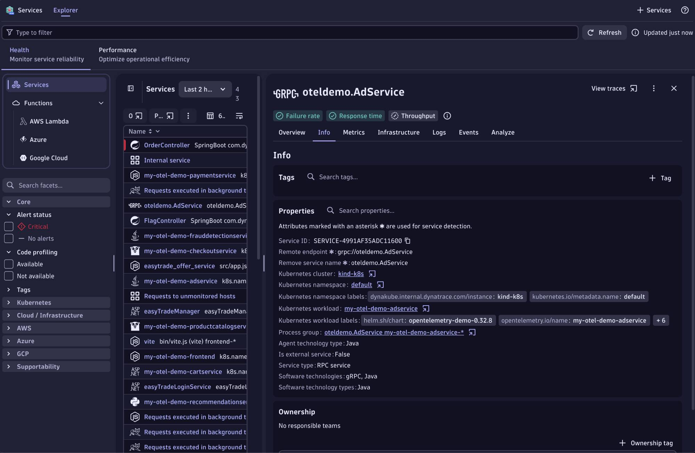

21. Navigate to the process group instance which shows an increase in CPU. Here we can see that the CPU has spiked and is over 90%. 

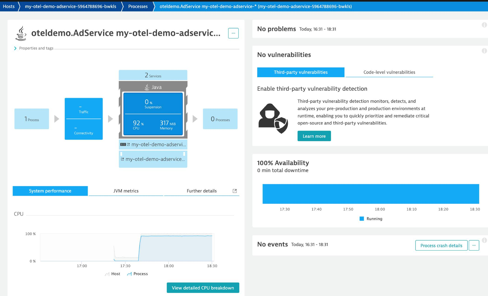

22. You can further navigate into the **View detailed CPU breakdown** button to analyze what is consuming the CPU. 

    In the Background thread CPU row, click on the three dots under **Actions** and select **Threads** to view the threads consuming the CPU time. Evntually diving deeper we can see the specific threads consuming the CPU. We can see 4 threads consuming CPU which should match the CPULoad threads we saw from the Live Debugger snapshot.

    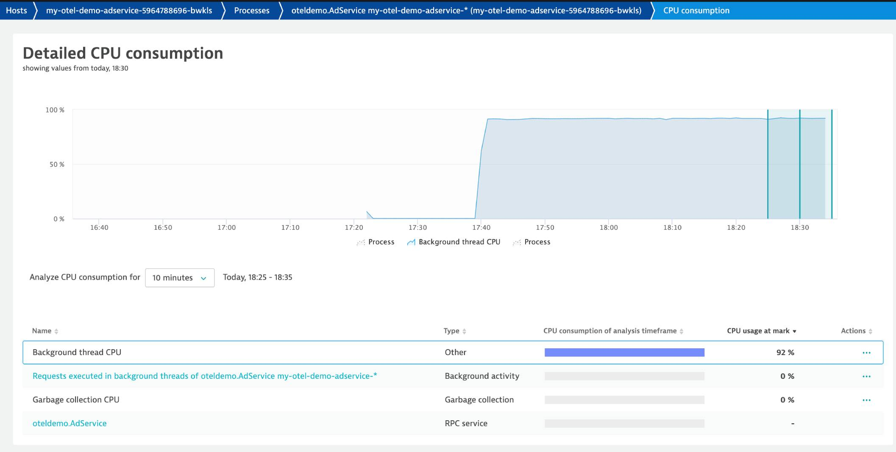

    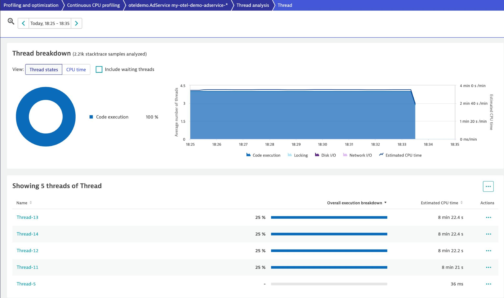
